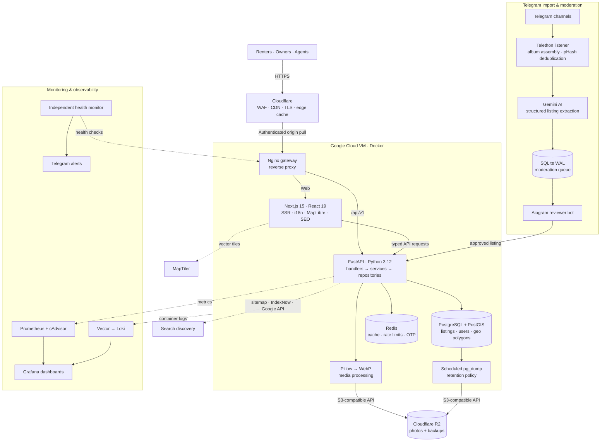

# MaiRent — logical architecture

```mermaid
flowchart TB
    U["Renters · Owners · Agents"] -->|HTTPS| CF["Cloudflare\nWAF · CDN · TLS · edge cache"]
    CF -->|Authenticated origin pull| GW["Nginx gateway\nreverse proxy"]

    subgraph APP["Google Cloud VM · Docker"]
      direction TB
      GW -->|Web| FE["Next.js 15 · React 19\nSSR · i18n · MapLibre · SEO"]
      GW -->|/api/v1| API["FastAPI · Python 3.12\nhandlers → services → repositories"]
      FE -->|typed API requests| API
      API --> PG[("PostgreSQL + PostGIS\nlistings · users · geo polygons")]
      API --> REDIS[("Redis\ncache · rate limits · OTP")]
      API --> MEDIA["Pillow → WebP\nmedia processing"]
      PG --> BACKUP["Scheduled pg_dump\nretention policy"]
    end

    MEDIA -->|S3-compatible API| R2[("Cloudflare R2\nphotos + backups")]
    BACKUP -->|S3-compatible API| R2

    subgraph IMPORT["Telegram import & moderation"]
      TG["Telegram channels"] --> LISTEN["Telethon listener\nalbum assembly · pHash deduplication"]
      LISTEN --> AI["Gemini AI\nstructured listing extraction"]
      AI --> Q[("SQLite WAL\nmoderation queue")]
      Q --> REVIEW["Aiogram reviewer bot"]
    end
    REVIEW -->|approved listing| API

    subgraph OBS["Monitoring & observability"]
      PROM["Prometheus + cAdvisor"] --> GRAF["Grafana dashboards"]
      VECTOR["Vector → Loki"] --> GRAF
      WATCH["Independent health monitor"] --> ALERT["Telegram alerts"]
    end
    API -.->|metrics| PROM
    APP -.->|container logs| VECTOR
    WATCH -.->|health checks| GW
    FE -.->|vector tiles| MAP["MapTiler"]
    API -.->|sitemap · IndexNow · Google API| INDEX["Search discovery"]
```

Dashed connections are support and telemetry flows. This illustration deliberately abstracts private network details and secret-bearing production configuration.
